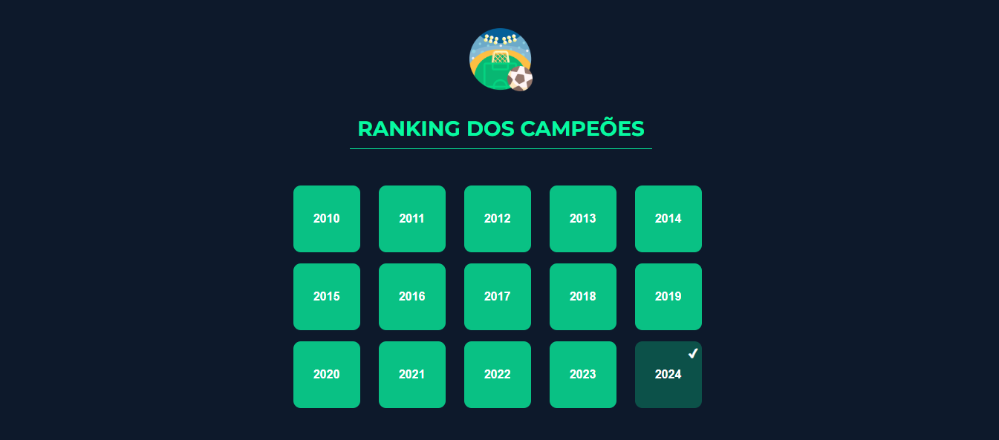
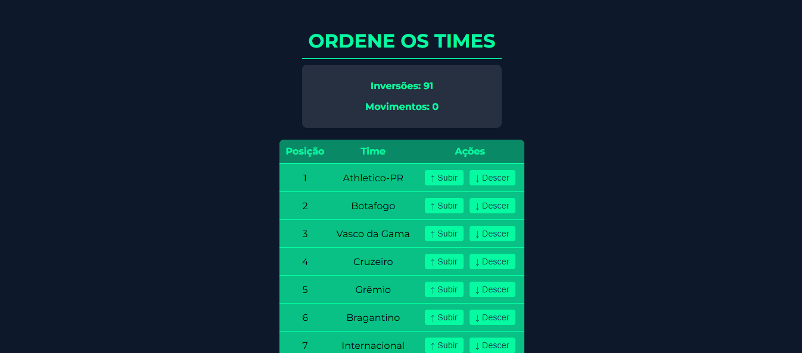
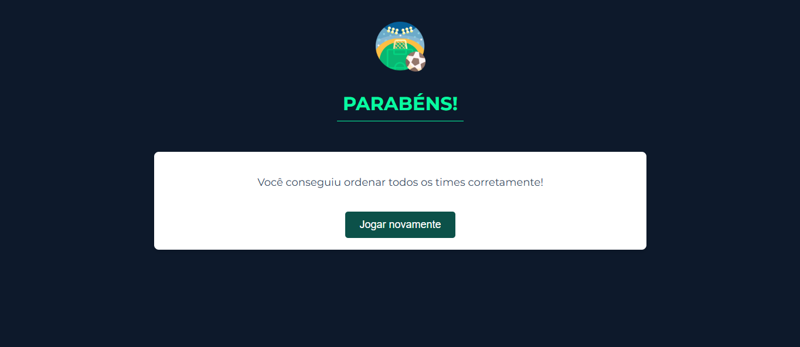

# Dividir e Conquistar

**Número da Lista**: 03<br>
**Conteúdo da Disciplina**: Dividir e Conquistar<br>

## [Para assistir a apresentação desta entrega, clique aqui!](https://youtu.be/jTkpLi7qdpI)

## Alunos
|Matrícula | Aluno |
| -- | -- |
| 19/0107243  |  Gabriel Pessoa Zaranza |
| 21/1063149  |  Izabella Alves Pereira |

## Sobre 

Este projeto propõe um jogo interativo que desafia o usuário a organizar a tabela do Campeonato Brasileiro utilizando o algoritmo de contagem de inversões. O objetivo é ordenar a tabela com o menor número possível de movimentos.

## Screenshots





## Uso 

Certifique-se de ter as seguintes ferramentas instaladas na sua máquina:

- Node.js (versão 16 ou superior recomendada)
- npm 

1. Clone o Repositório

```
git clone https://github.com/projeto-de-algoritmos-2024/DividirConquistar_RankingDosCampeoes
```

2. Acesse o Diretório do Projeto

```
cd DividirConquistar_RankingDosCampeoes
```

3. Instale as Dependências

```
npm install --legacy-peer-deps
```

4. Inicie o Servidor de Desenvolvimento

```
npm start
```

O projeto estará disponível no navegador no endereço: http://localhost:3000.

